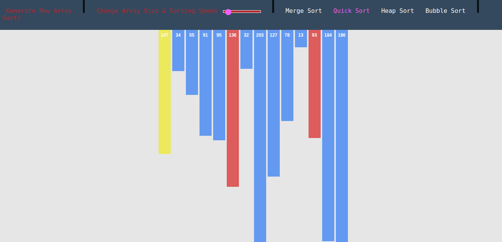

# Sorting_Algorithms_Visualizer

This application supports a graphic visualization of selected algorithms on randomly generated or manually created array, step-by-step execution possibility, pseudocode and current state of variables.

1. Download this repository and extract the file
2. Run 'index.html' file in browser

## Screenshot

